# 💱 FX Deals Warehouse (FX-DWH)

A simple Java Gradle application that ingests **foreign exchange (FX) deals** from either:
- a **CSV file**, or  
- a **single-line deal input**

and stores them in a **PostgreSQL** database using **Docker Compose**.

## 🧠 Overview

FX-DWH automates ingestion and validation of FX deals before persisting them in a relational database.  
It’s designed to be **modular**, **dockerized**, and **extensible** for future integration with analytics or reporting tools.


## ⚙️ Tech Stack

| Layer | Technology | Purpose |
|-------|-------------|----------|
| **Language** | Java 21 (Eclipse Temurin) | Core application logic |
| **Build Tool** | Gradle | Project build & dependency management |
| **Database** | PostgreSQL | Persistent storage for deals |
| **Connection Pool** | HikariCP | Efficient DB connection handling |
| **Containerization** | Docker & Docker Compose | Container orchestration |
| **Automation** | Makefile | Build & deployment shortcuts |
| **Logging** | SLF4J + Logback | Structured logging |
| **Testing** | JUnit | Unit tests |
| **Shell Utility** | `wait-for-it.sh` | Waits for DB readiness |


## 🧩 Architecture Diagram

### 📊 Data Flow


## 🏗️ Container Setup

### 📊 Data Flow




```mermaid
graph TD
    subgraph Docker_Network
        A[fx-dwh-app 🧠] -->|JDBC Connection| B[(Postgres DB 🗄️)]
    end
    A -->|Reads| C[CSV File 📄]
    A -->|or| D[Single Deal Input 💬]
```

## ⚙️ Prerequisites

Make sure you have the following installed:
- **Docker** & **Docker Compose**
- **Make**
- **Java 21+** and **Gradle** (only needed for local builds)


## 🚀 Build & Run

### 1. Build the Java project
```bash
make build
```
This runs Gradle’s installDist to build the application binaries into /app/build/install/app.

### 2. Build the Docker image
```bash
make docker
```
This creates a Docker image named fx-dwh using the built artifacts.

### 3. Start the full stack (Postgres + App)
```bash
make up
```
This runs both the Postgres database and the FX-DWH app containers against ```/app/sample-data/deals-sample.csv``` by default.


## 🧠 Running the App with Data (Unseen Deals)

You can pass data to the app either as a CSV file or a single deal line.
### ▶️ Option 1: Using a CSV file
```bash
make run FILE=/app/sample-data/deals-sample.csv
```
This loads all deals from the CSV file and inserts them into the database.

### ▶️ Option 2: Using a single-line deal input
```bash
make run DEAL="D-1006,USD,EUR,2025-09-30T10:15:30Z,10000.50"
```
This inserts one deal directly (without needing a CSV).


## 🧱 Database Schema

```sql
CREATE TABLE IF NOT EXISTS deals (
    id SERIAL PRIMARY KEY,
    deal_uid VARCHAR(100) NOT NULL,
    from_currency CHAR(3) NOT NULL,
    to_currency CHAR(3) NOT NULL,
    deal_timestamp TIMESTAMP WITH TIME ZONE NOT NULL,
    amount NUMERIC(20,6) NOT NULL,
    created_at TIMESTAMP WITH TIME ZONE DEFAULT now(),
    CONSTRAINT uq_deal_uid UNIQUE (deal_uid)
);
```


## 🧰 Common Make Commands

| Command             | Description                     |
| ------------------- | ------------------------------- |
| `make build`        | Build Java project using Gradle |
| `make docker`       | Build Docker image              |
| `make up`           | Start app + database            |
| `make down`         | Stop all containers             |
| `make run FILE=...` | Run app with CSV                |
| `make run DEAL=...` | Run app with single deal        |
| `make test`         | Run unit tests                  |
| `make clean`        | Clean Gradle build artifacts    |


## 🗄️ Accessing the Database
You can connect to the Postgres container:
```bash
docker exec -it fx-dwh-db psql -U postgres -d fxdb
```

then run:
```sql
SELECT * FROM deals;
```
##🧹 Restarting Everything

```bash
make down
```
Stops and removes all containers, networks, and volumes.


## 🧩 Notes
- The app automatically waits until Postgres is ready before starting (via wait-for-it.sh).
- Both CSV and single-line inputs are supported.
- Logs are shown in the terminal when running with Docker Compose.
- two csv files are provided within the app directory. Therefore, you can modify them directly to add new lines of deal, you can find them in:
  ```bash
  app/sample-data/deals-sample.csv
  app/sample-data/deals-sample2.csv
  ```


## 🏗️ Example End-to-End Run
```bash
make clean
make docker
make up
make run FILE=/app/sample-data/deals-sample.csv
make run DEAL="D-1006,EUR,JPY,2025-09-30T12:45:00Z,5000000"
```

## 🔮 Future Improvements

A future enhancement could expose the ingestion and querying logic via a RESTful API.
This would allow:
 - Submitting FX deals via ```POST /api/deals```
 - Retrieving stored deals via ```GET /api/deals```
 - Filtering or searching by currency pair, date, or amount range
 - Integrating with external systems or dashboards for live deal tracking
 - The API layer could be built using Spring Boot or Jakarta EE, running as a microservice alongside the existing ingestion component.


## Author: 
maram ©
ps: I used AI tool to help me write this read.me


